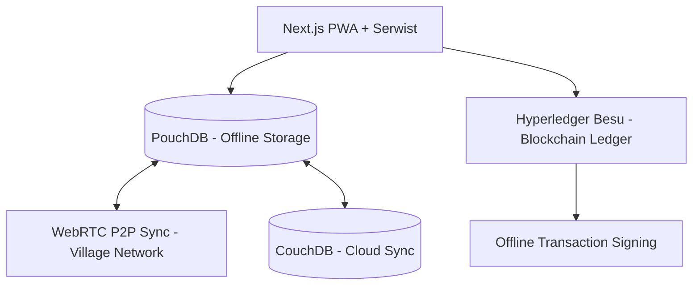

# LumbungData

> Empowering Indonesian smallholder farmers with offline-first agricultural data and blockchain-backed transparency.

[](https://github.com/vaskoyudha/LumbungData/actions/workflows/ci.yml)
[](https://opensource.org/licenses/Apache-2.0)
[](CONTRIBUTING.md)

## Problem Statement

Smallholder farmers in remote regions of Indonesia (Papua, NTT, interior Kalimantan) face significant challenges:
- **Unstable Internet**: Connectivity is often intermittent or non-existent in fields.
- **Data Scarcity**: Lack of reliable soil health data (pH, NPK) and local market price information.
- **Subsidy Transparency**: Difficulty in proving eligibility for government agricultural subsidies.

LumbungData addresses these by providing a platform that works entirely offline and uses peer-to-peer synchronization to bridge the digital divide.

## Architecture Overview

LumbungData uses an offline-first, decentralized architecture to ensure data availability in remote areas.



## Tech Stack

| Category | Technology |
| :--- | :--- |
| **Frontend** | Next.js 15+, Serwist (PWA), Tailwind CSS |
| **Backend** | Node.js (API), Express |
| **Database** | PouchDB (local), CouchDB (cloud) |
| **P2P Sync** | WebRTC |
| **Blockchain** | Hyperledger Besu |
| **Monorepo** | Turborepo, pnpm |

## Quick Start

### Prerequisites
- Node.js 20+
- pnpm 9+
- Docker (for database/blockchain services)

### Installation
1. Clone the repository:
   ```bash
   git clone https://github.com/vaskoyudha/LumbungData.git
   cd LumbungData
   ```

2. Install dependencies:
   ```bash
   pnpm install
   ```

3. Start development:
   ```bash
   pnpm dev
   ```

### Docker Compose Quickstart
(Coming soon) - Run `docker compose up` to start a local development environment with CouchDB and Hyperledger Besu.

## Project Structure

- `apps/web`: Next.js PWA for farmers and field agents.
- `apps/api`: Backend service for cloud synchronization and blockchain interaction.
- `packages/db`: Shared database schemas and PouchDB configurations.
- `packages/p2p`: WebRTC peer-to-peer synchronization logic.
- `packages/blockchain`: Smart contracts and blockchain interaction utilities.

## Screenshots
*(Coming soon — LumbungData is currently in its early development phase.)*

## Roadmap

### Phase 1: Foundation (Current)
- [x] Monorepo scaffolding and CI setup.
- [ ] Offline soil health and market price recording.
- [ ] Local PouchDB storage and Serwist PWA integration.
- [ ] Basic Peer-to-Peer (WebRTC) synchronization within village networks.
- [ ] Blockchain-backed subsidy eligibility ledger.

### Phase 2: Intelligence & Expansion (Future)
- [ ] Advanced agricultural data analytics and soil health recommendations.
- [ ] Natural Language Processing (NLP) for local dialects.
- [ ] Expanded market price forecasting and logistics optimization.

## Contributing

We welcome contributions from everyone! See our [CONTRIBUTING.md](CONTRIBUTING.md) for development setup and guidelines.

## License

This project is licensed under the Apache License 2.0. See the [LICENSE](LICENSE) file for details.
