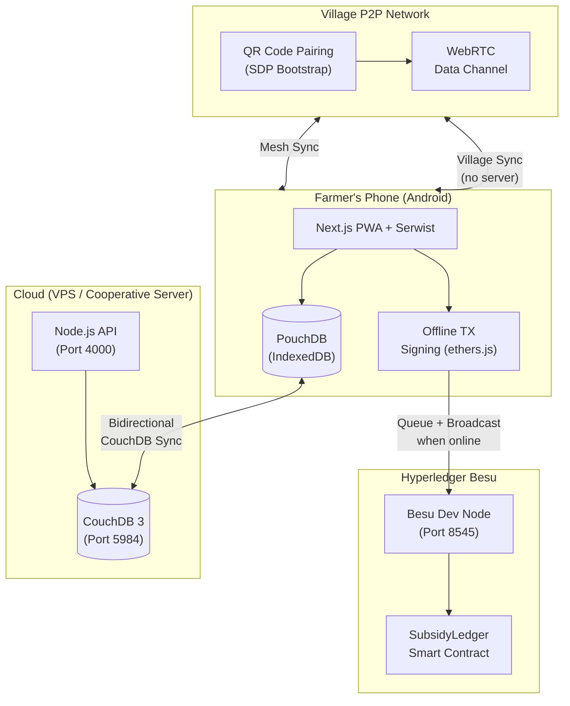

# LumbungData

> Empowering Indonesian smallholder farmers with offline-first agricultural data and blockchain-backed transparency.

[](https://github.com/vaskoyudha/LumbungData/actions/workflows/ci.yml)
[](https://opensource.org/licenses/Apache-2.0)
[](CONTRIBUTING.md)
[](https://nodejs.org)

## Problem Statement

Smallholder farmers in remote regions of Indonesia (Papua, NTT, interior Kalimantan) face three critical challenges:

- **No Internet Connectivity**: Fields have no 4G/5G. Farmers cannot sync data until they reach town.
- **No Soil Data**: Without pH and NPK readings, farmers cannot optimize fertilizer use. Subsidized fertilizer is often wasted.
- **Opaque Subsidy System**: Government seed and fertilizer subsidies require paper trails that are lost or forged. Farmers in remote areas cannot prove eligibility.

LumbungData solves all three: offline-first data collection, village-level P2P sync via WebRTC, cloud sync when connectivity returns, and immutable subsidy proof on Hyperledger Besu.

---

## Architecture



**Data flow**: Farmer enters soil/market data offline → PouchDB stores locally → When a villager with internet syncs, data replicates to CouchDB → Subsidy distributions are signed offline and broadcast when connectivity is available.

---

## Tech Stack

| Category | Technology | Version |
| :--- | :--- | :--- |
| **Frontend** | Next.js (App Router) | 16.2.0 |
| **PWA** | Serwist | 9.5.7 |
| **Styling** | Tailwind CSS | 4.2.2 |
| **i18n** | next-intl (id + en) | 4.8.3 |
| **Runtime** | React | 19.2.4 |
| **Offline DB** | PouchDB (IndexedDB adapter) | 9.x |
| **Cloud DB** | CouchDB | 3.x |
| **P2P** | WebRTC Data Channels + QR SDP | Browser native |
| **Blockchain** | Hyperledger Besu | latest |
| **Smart Contracts** | Solidity 0.8.24 + Hardhat | 2.x |
| **TX Signing** | ethers.js (lazy-loaded) | v6 |
| **API** | Express | 4.x |
| **Monorepo** | Turborepo + pnpm | pnpm 9.15.0 |
| **Language** | TypeScript (strict) | 5.9.3 |
| **Testing** | Vitest + Playwright | 2.x / 1.49 |

---

## Quick Start

### Prerequisites
- Node.js 20+
- pnpm 9.15.0+
- Docker + Docker Compose (for CouchDB and Besu)

### Development

```bash
# Clone
git clone https://github.com/vaskoyudha/LumbungData.git
cd LumbungData

# Install all workspace dependencies
pnpm install

# Start all services (Next.js + API in watch mode)
pnpm dev
```

The web app starts at `http://localhost:3000`. It uses Bahasa Indonesia by default; switch to English at `http://localhost:3000/en`.

### With Docker (Full Stack)

```bash
# Copy and configure environment
cp .env.example .env

# Start CouchDB + Besu + API + Web
docker compose up -d

# Verify services
curl http://localhost:5984/_up           # CouchDB
curl http://localhost:4000/health        # API
curl http://localhost:3000               # Web PWA
```

Services:
| Service | Port | URL |
| :--- | :--- | :--- |
| Web PWA | 3000 | http://localhost:3000 |
| API | 4000 | http://localhost:4000 |
| CouchDB | 5984 | http://localhost:5984 |
| Besu RPC | 8545 | http://localhost:8545 |
| Besu WS | 8546 | ws://localhost:8546 |

---

## Project Structure

```
LumbungData/
├── apps/
│   ├── web/                    # @lumbung/web — Next.js 16 PWA
│   │   ├── app/[locale]/       # i18n routes (id, en)
│   │   ├── src/components/     # React components
│   │   ├── src/hooks/          # useOnlineStatus, useStorageQuota, etc.
│   │   ├── src/providers/      # SyncProvider, i18n wrappers
│   │   ├── messages/           # id.json, en.json (next-intl)
│   │   └── e2e/                # Playwright E2E tests
│   ├── api/                    # @lumbung/api — Express API
│   └── blockchain/             # @lumbung/blockchain — Hardhat workspace
│       └── contracts/          # SubsidyLedger.sol
├── packages/
│   ├── db/                     # @repo/db — PouchDB schemas + SyncOrchestrator
│   ├── p2p/                    # @repo/p2p — WebRTC + QR SDP signaling
│   ├── blockchain/             # @repo/blockchain — ethers.js TX queue
│   ├── ui/                     # @repo/ui — shared React components
│   ├── shared/                 # @repo/shared — types, utilities
│   └── config/                 # @repo/config — ESLint, TypeScript configs
├── docs/
│   ├── deployment.md           # VPS deployment guide
│   └── architecture.md         # Technical architecture reference
├── docker-compose.yml          # Full-stack Docker Compose
├── .env.example                # Environment variable template
├── turbo.json                  # Turborepo pipeline
└── playwright.config.ts        # E2E test config (desktop + mobile)
```

---

## Features

### Offline-First Data Collection
- Soil health recording: pH, N/P/K levels, moisture, location name
- Market price tracking: commodity prices with unit and market name
- All data persists to IndexedDB via PouchDB with no network required

### Village P2P Synchronization
- Two farmers scan each other's QR codes to establish a WebRTC Data Channel
- SDP offer/answer compressed and encoded in QR (< 2KB)
- Data chunked and transferred with backpressure control
- CouchDB revision tree used for conflict resolution (no wall-clock dependency)

### Cloud Sync
- Bidirectional PouchDB ↔ CouchDB replication when internet available
- SyncOrchestrator coordinates: local → P2P → cloud → blockchain
- Conflict resolution via CouchDB `_rev` — last writer wins on leaf

### Subsidy Ledger (Blockchain)
- `SubsidyLedger.sol`: immutable record of seed/fertilizer distributions
- Offline transaction signing with ethers.js wallet
- Transactions queued in IndexedDB, broadcast when connectivity returns
- Query distributions by farmer address on-chain

### Farmer-Friendly UI
- Bahasa Indonesia by default, English switchable
- Mobile-first responsive design (tested on Pixel 5 viewport)
- Offline indicator with sync status bar
- Storage quota monitoring with persist() to prevent Android clearing IndexedDB

---

## Performance Metrics

| Metric | Value | Budget |
| :--- | :--- | :--- |
| Initial JS (all routes) | < 200KB gzipped | 200KB |
| PouchDB (lazy-loaded) | ~30KB | lazy only |
| ethers.js (lazy-loaded) | ~80KB | lazy only |
| i18n bundle overhead | ~3KB | — |
| Unit Tests | 64 passing | — |
| E2E Tests | 15 tests × 2 projects | — |

---

## Roadmap

### Phase 1: Foundation ✅ Complete
- [x] Monorepo scaffolding (Turborepo + pnpm)
- [x] PWA shell with Serwist offline support
- [x] Shared packages (db, p2p, blockchain, ui, config)
- [x] GitHub Actions CI/CD pipeline
- [x] i18n support (Bahasa Indonesia + English)
- [x] Farmer-friendly UI components
- [x] Soil health data entry + PouchDB storage
- [x] Market price data entry
- [x] CouchDB cloud sync endpoints
- [x] PouchDB ↔ CouchDB bidirectional sync
- [x] Storage quota monitoring
- [x] WebRTC spike (RxDB vs custom — custom chosen)
- [x] QR-code SDP signaling for P2P bootstrap
- [x] WebRTC Data Channel sync engine
- [x] Sync status indicators in UI
- [x] SubsidyLedger smart contract (Solidity 0.8.24)
- [x] Offline transaction signing (ethers.js v6)
- [x] Transaction queue (IndexedDB-backed)
- [x] Subsidy UI (record + verify)
- [x] Besu dev node in Docker
- [x] Smart contract unit tests (13 tests)
- [x] SyncOrchestrator (unified sync lifecycle)
- [x] Farmer dashboard
- [x] Offline indicator
- [x] Full-stack Docker Compose
- [x] Comprehensive E2E test suite

### Phase 2: Intelligence & Expansion (Future)
- [ ] Soil health recommendations (AI/ML inference)
- [ ] Local dialect NLP support
- [ ] Market price forecasting
- [ ] IBFT multi-node Besu production setup

---

## Testing

```bash
# Unit tests (Vitest — 64 tests across 8 files)
pnpm test

# E2E tests (Playwright — desktop + mobile Chrome)
pnpm test:e2e

# Smart contract tests (Hardhat — 13 tests)
pnpm --filter @lumbung/blockchain test
```

E2E test suites:
- `full-workflow.spec.ts` — end-to-end soil and market data flow
- `offline-resilience.spec.ts` — offline toggle, data persistence
- `p2p-e2e.spec.ts` — P2P pairing UI flow
- `blockchain-e2e.spec.ts` — subsidy recording and verification
- `i18n-e2e.spec.ts` — language switching

---

## Contributing

See [CONTRIBUTING.md](CONTRIBUTING.md) for development setup, commit conventions, and PR process.

## Deployment

See [docs/deployment.md](docs/deployment.md) for production VPS deployment.

## Architecture Deep-Dive

See [docs/architecture.md](docs/architecture.md) for sync protocol, database schema, and API reference.

---

## License

Apache License 2.0 — see [LICENSE](LICENSE). Copyright 2026 LumbungData Contributors.

> Built with ❤️ for smallholder farmers in Indonesia's remote regions. Data sovereignty. Community resilience.
