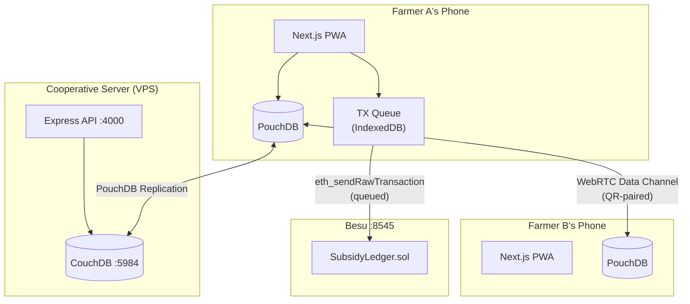

# LumbungData — Technical Architecture

## System Overview

LumbungData is an offline-first, decentralized data platform. The core design principle: **data must be usable with zero connectivity**, with sync happening opportunistically when network is available.



## Data Flow

### 1. Offline Data Entry
```
User fills soil form
  → React state
  → packages/db SoilReading schema validation
  → PouchDB.put({ _id: uuid, type: 'soil_reading', farmerId, pH, ... })
  → IndexedDB (persisted locally)
```

### 2. Village P2P Sync (QR Bootstrap)
```
Farmer A: generate WebRTC offer SDP
  → compress with CompressionStream (deflate-raw)
  → encode as QR code
  → display on screen

Farmer B: scan QR code
  → decode + decompress SDP
  → create answer SDP
  → display answer QR

Farmer A: scan answer QR
  → ICE candidates exchanged
  → RTCDataChannel established

Sync:
  → each side reads PouchDB changes since last sync
  → serialize documents as JSON chunks (64KB max)
  → send via DataChannel with backpressure control
  → receiver writes to PouchDB (CouchDB rev-based conflict merge)
```

### 3. Cloud Sync
```
Online status detected (useOnlineStatus hook)
  → SyncOrchestrator.startCloudSync()
  → PouchDB.sync(couchdbUrl, { live: false })
  → Bidirectional replication
  → CouchDB conflict resolution: _rev tree, automatic leaf winner
```

### 4. Blockchain (Subsidy Ledger)
```
Distributor records subsidy offline:
  → SubsidyDistribution object created (farmerId, subsidy type, qty)
  → ethers.Wallet.signTransaction() with local private key
  → Signed TX stored in IndexedDB queue

When online:
  → TxQueueProcessor reads queue
  → eth_sendRawTransaction to Besu
  → TX hash stored; queue entry cleared
```

## Database Schema

### PouchDB Document Types

#### SoilReading
```typescript
interface SoilReading {
  _id: string;          // UUID
  _rev?: string;        // CouchDB revision
  type: 'soil_reading';
  farmerId: string;     // localStorage farmer profile ID
  ph: number;           // 0-14
  nitrogen: number;     // mg/kg
  phosphorus: number;   // mg/kg
  potassium: number;    // mg/kg
  moisture: number;     // percentage
  location: string;     // village/field name
  recordedAt: number;   // Unix timestamp (ms)
  syncedAt?: number;    // Set when synced to CouchDB
}
```

#### MarketPrice
```typescript
interface MarketPrice {
  _id: string;
  _rev?: string;
  type: 'market_price';
  commodity: string;    // e.g., 'Padi', 'Jagung'
  price: number;        // IDR per kg
  unit: string;         // 'kg', 'ton'
  market: string;       // market name
  recordedAt: number;
  syncedAt?: number;
}
```

#### FarmerProfile (localStorage, not PouchDB)
```typescript
interface FarmerProfile {
  id: string;           // localStorage key: lumbung_farmer_id
  name: string;
  village: string;
  phone: string;
}
```

### SubsidyLedger (On-chain)
```solidity
struct Distribution {
    address farmerId;     // farmer's wallet address
    address distributorId;// distributor's wallet address
    string subsidyType;   // "SEED" | "FERTILIZER"
    uint256 quantity;     // amount in grams
    uint256 distributedAt;// block.timestamp
}
```

## API Endpoints

The Express API (`apps/api`) provides CouchDB proxy and health endpoints:

| Method | Path | Description |
| :--- | :--- | :--- |
| GET | `/health` | Health check — returns `{"status":"ok"}` |
| GET | `/api/sync/status` | CouchDB connection status |
| POST | `/api/sync/trigger` | Trigger manual CouchDB replication |
| GET | `/api/db/:dbName/_all_docs` | Proxy to CouchDB |
| PUT | `/api/db/:dbName/:docId` | Proxy write to CouchDB |

PouchDB replication talks directly to CouchDB (`http://couchdb:5984/lumbung`) — the API is not in the sync path for PouchDB replication.

## Sync Protocol Details

### Conflict Resolution
- CouchDB uses MVCC with `_rev` (e.g., `1-abc123`)
- On conflict, CouchDB keeps all leaf revisions — the "winner" is deterministically chosen by rev hash
- LumbungData does not implement custom merge logic in v1 — last-write-wins on the leaf is acceptable for agricultural data (soil readings are append-only in practice)

### QR-Code SDP Size
- Raw WebRTC SDP: ~2-4 KB
- After `CompressionStream('deflate-raw')`: ~600-900 bytes
- Base64 encoded: ~1200 bytes
- QR code capacity at medium error correction: 2953 bytes — fits comfortably

### P2P Sync Session Lifecycle
```
1. Initiator → shows offer QR
2. Responder → scans offer, shows answer QR
3. Initiator → scans answer
4. ICE gathering completes (STUN-free, LAN ICE candidates)
5. DataChannel opens
6. Both sides: read PouchDB allDocs → send changes
7. Session closes after transfer complete
```

## Monorepo Build Graph

```
@repo/config (no deps)
  ↓
@repo/shared (depends on config)
  ↓
@repo/db, @repo/p2p, @repo/ui (depend on shared)
  ↓
@repo/blockchain (depends on shared)
  ↓
@lumbung/web (depends on all packages)
@lumbung/api (depends on shared, db)
@lumbung/blockchain (depends on blockchain)
```

Turborepo caches build outputs. `turbo build` only rebuilds changed packages.

## Key Design Decisions

### Why PouchDB over RxDB?
RxDB's WebRTC plugin uses a signaling server for SDP exchange — incompatible with the no-server QR constraint. Custom PouchDB-over-DataChannel with chunked JSON was simpler and gave full control over the sync protocol.

### Why Hyperledger Besu over public chains?
Government subsidy use cases in Indonesia require a permissioned chain:
- Transactions must be free (no gas fees for farmers)
- Data must not be publicly readable on a global chain
- Local NGO/cooperative must operate the node

### Why next-intl over react-i18next?
Server-side message loading (RSC-native), smaller bundle (~2KB vs ~10KB), and built-in Next.js App Router integration.

### Why CouchDB over PostgreSQL?
- Built-in PouchDB replication protocol (zero custom code for sync)
- Document store matches the flexible schema of soil readings
- Conflict resolution via `_rev` is built-in

## Security Considerations

- **No authentication system** in v1 — appropriate for trusted cooperative deployments
- **Private keys** for subsidy signing are stored in browser localStorage — acceptable for NGO distributor devices that are physically controlled
- **CouchDB** should be configured with admin credentials and CORS restricted to the PWA origin in production (see deployment guide)
- **Besu** runs in dev mode for v1 — single node, no IBFT consensus — production upgrade path is multi-node IBFT 2.0

## Performance Characteristics

- **Initial page load**: < 200KB gzipped JS (all routes)
- **PouchDB lazy-loaded**: adds ~30KB on first data operation
- **ethers.js lazy-loaded**: adds ~80KB on first blockchain operation
- **IndexedDB writes**: < 50ms for single document
- **WebRTC Data Channel throughput**: ~10 MB/s on LAN
- **CouchDB replication**: ~500 docs/second on VPS
